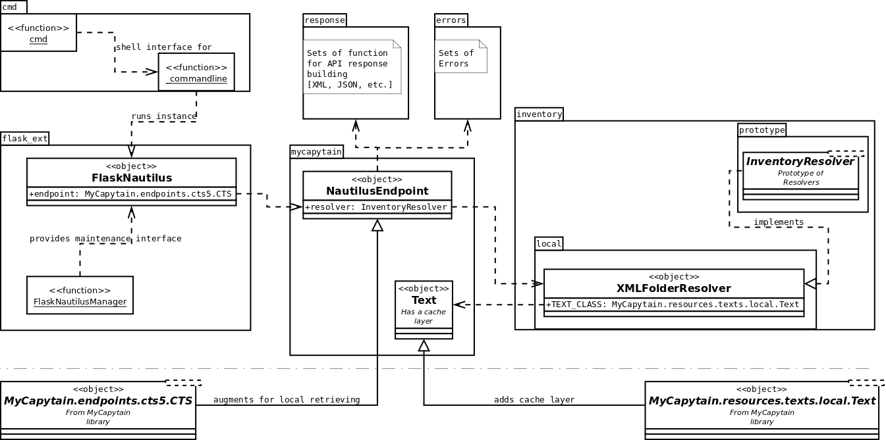

Capitains Nautilus API Documentation
============================

Library Structure
#################

Resolvers
#########

Resolver provides a system to retrieve a text file and an inventory from local resources for example.

CapiTainS formatted repository
******************************

.. autoclass:: capitains_nautilus.inventory.local.XMLFolderResolver
    :members:

Prototype
*********

.. autoclass:: capitains_nautilus.inventory.proto.InventoryResolver
    :members:

Retriever
#########

Extension of MyCapytains resources
**********************************

.. automodule:: capitains_nautilus.mycapytain
    :members:
    :undoc-members:
    :show-inheritance:

Responses builders
******************

.. automodule:: capitains_nautilus.errors
    :members:
    :undoc-members:
    :show-inheritance:

Errors
######

.. automodule:: capitains_nautilus.errors
    :members:
    :undoc-members:
    :show-inheritance:

Utilities
#########

.. automodule:: capitains_nautilus.cmd
    :members:
    :undoc-members:
    :show-inheritance:

Flask Extension
#########

.. automodule:: capitains_nautilus.flask_ext
    :members:
    :undoc-members:
    :show-inheritance: