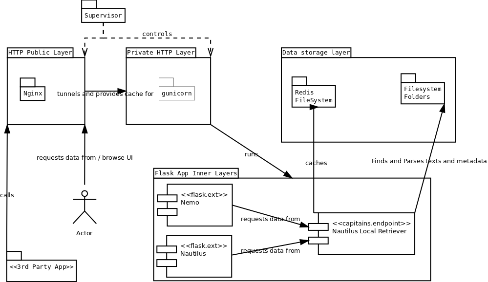

Nautilus' Production Environment deployment advices
===================================================

Environment
###########

We recommend highly to use Debian based configuration as they are the only one having been tested for now. The following configuration takes into account what we think might be the best configuration available with a good cache system.

You can use a docker image we built and fork it for your own use. As of *April 11th, 2016*, the **docker image does not use Redis-based cache** but filesystem based cache.

The environment we propose contains a flask.ext.nemo instance, for control purposes. Disabling it is documented.

Nginx, Supervisor, GUnicorn
###########################

Nginx
*****

Explanation paragraph for Nginx (tuning)

Supervisor
**********

Explanation paragraph for Supervisor (tuning). Remember to explain the python 2 dependencies

.. code-block:: ini

	[supervisord]
	nodaemon = true

	[program:nginx]
	command = /usr/sbin/nginx
	startsecs = 5
	stdout_events_enabled = true
	stderr_events_enabled = true

	[program:app-gunicorn]
	# See explanation for this line
	command=/usr/local/bin/gunicorn app:app -w 4 --threads 2 -b 127.0.0.1:5000 --log-level=debug --pythonpath /usr/bin/python3
	directory=/code
	stdout_events_enabled = true
	stderr_events_enabled = true

	[eventlistener:stdout]
	command = supervisor_stdout
	buffer_size = 100
	events = PROCESS_LOG
	result_handler = supervisor_stdout:event_handler

Flask Application Configuration
###############################

Nemo And FileSystemCache (Easy to maintain)
*******************************************

The following configuration is based on a FileSystemCache. This means that you do not need to install, run and maintain more advanced Cache system such as Redis. This also means this should be slower. The implementation contains a frontend, you should be able to run it without it.

.. code-block:: python

	# -*- coding: utf-8 -*-

	from flask import Flask, request
	from flask.ext.nemo import Nemo
	from capitains_nautilus.flask_ext import FlaskNautilus
	from werkzeug.contrib.cache import FileSystemCache
	from flask_cache import Cache

	app = Flask("Nautilus")
	nautilus_cache = FileSystemCache("/code/cache")
	nautilus = FlaskNautilus(
	    app=app,
	    prefix="/api/cts",
	    name="nautilus",
	    # Add here paths to all CapiTainS repository you have locally
	    resources=["/code/data/canonical-latinLit-master"],
	    parser_cache=nautilus_cache,
	    http_cache=Cache(config={'CACHE_TYPE': "simple"})
	)
	# We set up Nemo
	# This part can be removed 
	nemo = Nemo(
	    app=app,
	    name="nemo",
		base_url="",
		api_url="/api/cts",
	    endpoint=nautilus.endpoint
	)
	# We register its routes
	nemo.register_routes()
	# We register its filters
	nemo.register_filters()

	# Removes this line for production
	app.debug = True
	
	if __name__ == "__main__":
	    app.run(debug=True, host='0.0.0.0')